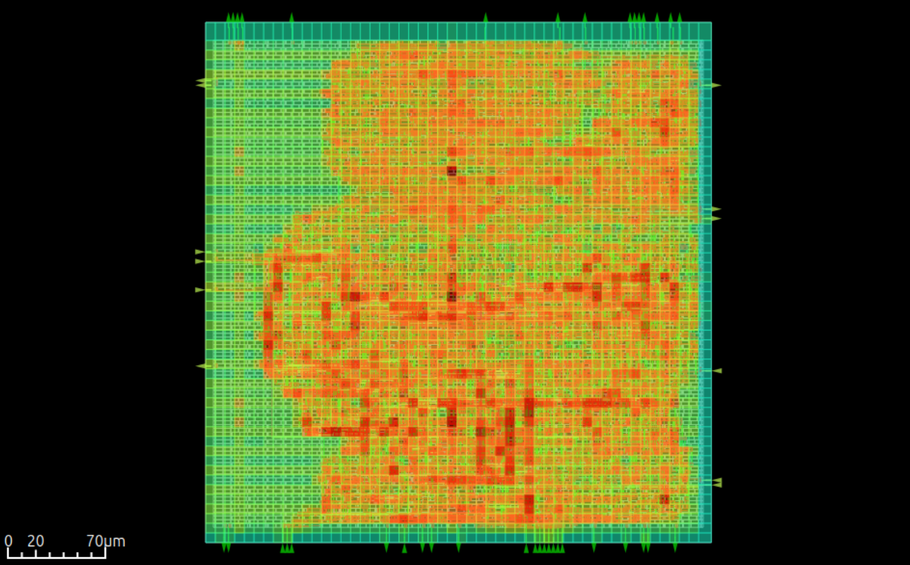

# Spike Detection & Time Series Segmentation

This repository contains the Verilog implementation of an efficient, on-device spike detection and time-series segmentation system for high-density neural implants. The design aims for low-latency, low-power operation suitable for implantable hardware.

## Overview

The core logic implements a lightweight algorithm for detecting epileptic spikes in multichannel neural recordings. Key components include:
*   **Feature Extractors**: Hardware implementations of various spike detection algorithms including:
    *   Nonlinear Energy Operator (NEO)
    *   Absolute Value (ABS)
    *   Smoothed ABS (ASO)
    *   Difference (ADO)
    *   Z-Score / Standard Deviation based methods
*   **Classifier**: Heuristic rule-based event classification logic.
*   **Top Level**: Integrates extractors and reasoning logic to output detection flags.

The system is designed to be synthesizable for both FPGA (targeting Zynq 7020) and ASIC (SkyWater 130nm via Librelane).

## Repository Structure

*   **`src/`**: Verilog source code.
    *   `feature_extractors/`: Individual detector modules.
    *   `classifiers/`: Classification logic.
    *   `top_level_module/`: Top-level integration.
*   **`tb/`**: Testbenches.
    *   `verilog/`: Traditional Verilog testbenches.
    *   `cocotb/`: Python-based Cocotb verification environment.
*   **`librelane/`**: Configuration and scripts for the ASIC physical design flow.
*   **`Makefile`**: Build and test automation.

## Simulation & Verification

The project supports both standard Verilog simulation (using Icarus Verilog or Verilator) and Python-based verification using Cocotb.

### Prerequisites
*   Icarus Verilog (`iverilog`) or Verilator
*   Python 3
*   Cocotb (`pip install cocotb`)
*   GTKWave (for waveform viewing)

### Setup Python Environment

Ensure you have Poetry installed. Then, run the following in the project root:

```bash
# Install dependencies into a virtual environment
make setup

# Activate the virtual environment
poetry shell
```

### Running Verilog Tests
To run the standard Verilog testbenches:
```bash
# Run simulation and generate waveforms
make test-rtl

# View RTL testbench waveforms
make view-rtl
```

### Running Cocotb Tests
To run the advanced verification suite using Cocotb:
```bash
# Run functional tests with Python
make test-cocotb

# View Cocotb waveforms
make view-cocotb
```

### Running the Classifier Test
To run the classifier specific Verilog testbench:
```bash
make test-classifier
```

## ASIC Implementation (Librelane)

This project is configured for the **Librelane** automated RTL-to-GDSII flow, targeting the SkyWater 130nm process (`sky130`).

### Prerequisites
*   Librelane installed and configured in your environment.
*   SkyWater 130nm PDK.

### Running the Flow
To harden the design (Synthesis, P&R, Signoff), run the following command from the project directory:

```bash
# Run full ASIC flow
make librelane
```

To visualize the final layout in OpenROAD:

```bash
# Open the synthesized design in OpenROAD GUI
make view-openroad
```
The result of the synthesis is available in the image below.


### Output
Results are generated in `librelane/runs/RUN_<timestamp>/`. Key outputs include:
*   `gds/`: Final layout file.
*   `reports/`: Timing, area, and power reports.
*   `results/`: Final netlists and DEF files.

## Reporting & Analysis

A helper script is provided to extract key manufacturability metrics (Area, Power, Timing, Fmax) from the Librelane run logs.

### Usage
After a Librelane run completes, execute the script from the project root or `librelane` folder:

```bash
python3 librelane/extract_reports.py
```

### Metrics Generated
The script scans the latest run directory and outputs a summary to the console and to `librelane/report_manufacturability.txt`. Metrics include:
*   **Logic Area**: Cell area after synthesis.
*   **Physical Area**: Final core and die dimensions.
*   **Utilization**: Standard cell density.
*   **Power**: Total power consumption (Internal, Switching, Leakage).
*   **Timing**: Critical path slack and theoretical Maximum Frequency (Fmax).
*   **Routing**: Total wire length and via counts.
